## AWS S3 Security

**Introduction**

- Amazon S3 provides an optimal foundation because of its virtually unlimited scalability. You can seamlessly and nondisruptively increase storage from gigabytes to petabytes of content, paying only for what you use. Amazon S3 is designed to provide 99.999999999% durability. 
- It has scalable performance, ease-of-use features, and native encryption and access control capabilities. Amazon S3 integrates with a broad portfolio of AWS and third-party ISV data processing tools. 
- With the wide usage of Amazon S3 it is important to configure the right security positure to it and below are a couple of security configuration we should enable
  - Enable Https
  - Enable SSE-S3 Encryption
  - Configure S3 Block Public Access
  - Restrict Access To A S3 Vpc Endpoint
  - Use AWS Config Rules To Detect A Public Bucket
  - Use Amazon Access Analyzer For S3


  **i. Enable Https**

  In this section we will create a S3 Bucket Policy that requires connections to use HTTPS
   1. From the AWS console, click Services and select S3

   2. Select the bucket name

   3. Select on the Permissions tab

   4. Under Bucket Policy click Edit

   5. Copy the bucket policy below and paste into the Bucket Policy Editor and Select Save changes

           {
            "Statement": [
            {
               "Action": "s3:*",
               "Effect": "Deny",
               "Principal": "*",
               "Resource": "arn:aws:s3:::BUCKET_NAME/*",
               "Condition": {
                   "Bool": {
                    "aws:SecureTransport": false
                    }
                }
                }
              ]
            }
      
        Replace BUCKET_NAME with the bucket name you copied to your text editor
        
        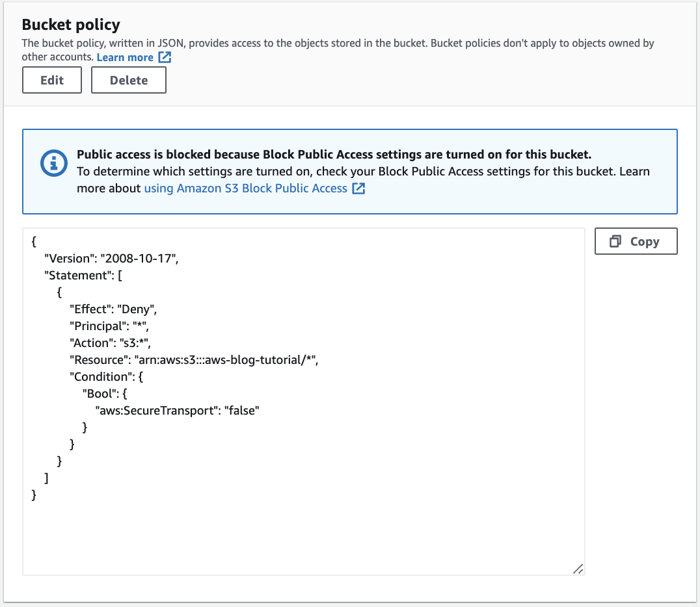

    6. Run the following command

       ```markdown 
        aws s3api head-object --key app1/file1 --endpoint-url http://s3.amazonaws.com --bucket ${bucket}
       ```

        Output will return a 403 error as the endpoint-url is HTTP

        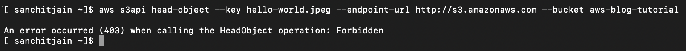

    7. Now run the following command

       ```markdown 
        aws s3api --endpoint-url https://s3.amazonaws.com head-object --key app1/file1 --bucket ${bucket}
       ```

        As we are leveraging s3api which uses HTTPS output will be successful 

        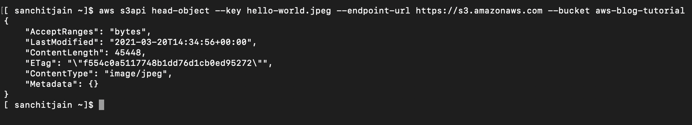


  **ii. Enable SSE-S3 Encryption**
  
  In this section we will create a S3 Bucket Policy that requires data at rest encryption
   1. From the AWS console, click Services and select S3

   2. Select the bucket name

   3. Select on the Permissions tab

   4. Under Bucket Policy click Edit

   5. Copy the bucket policy below and paste into the Bucket Policy Editor and Select Save changes

           {
            "Statement": [
                {
                    "Effect": "Deny",
                    "Principal": "*",
                    "Action": "s3:PutObject",
                    "Resource": "arn:aws:s3:::BUCKET_NAME/*",
                    "Condition": {
                        "StringNotEquals": {
                            "s3:x-amz-server-side-encryption": "AES256"
                        }
                    }
                }
            ]
           }

        Replace BUCKET_NAME with the bucket name you copied to your text editor
        
        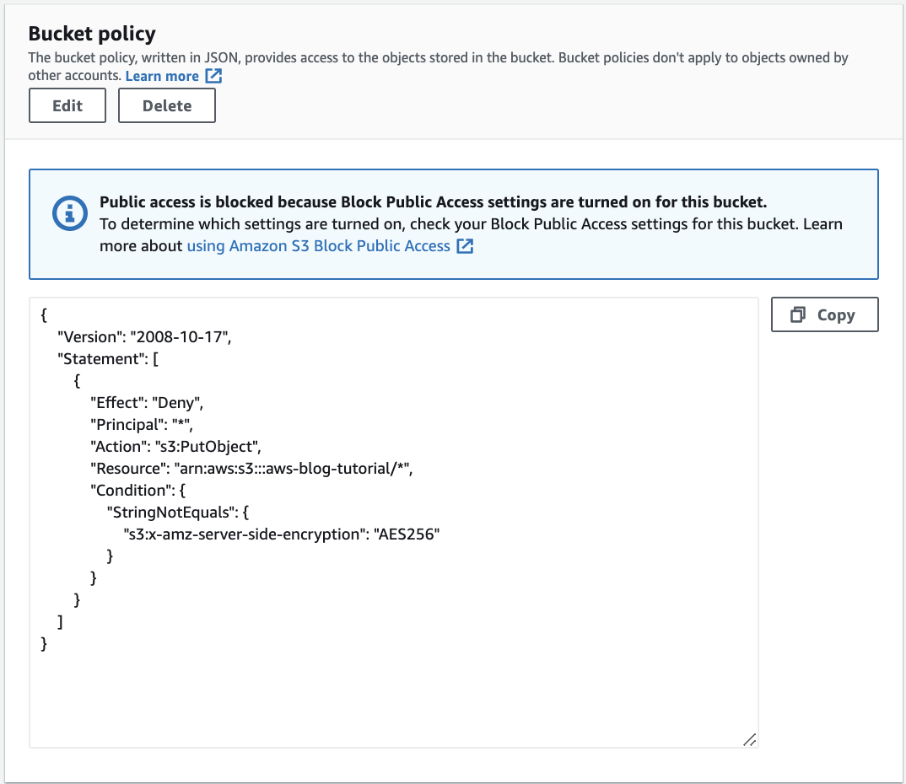

    6. Run the following command

       ```markdown 
        aws s3api put-object --key text01 --bucket ${bucket}  
       ```

        Request will fail, as the object is not encrypted.

        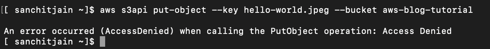

    7. Now run the following command using SSE-S3 encryption

       ```markdown 
        aws s3api put-object --key text01 --server-side-encryption AES256 --bucket ${bucket} 
       ```

        Command succeeded as SSE-S3 is enabled

        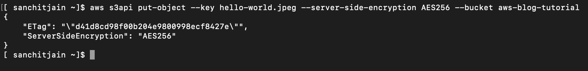


  **iii. Configure S3 Block Public Access**
  
  In this section we will enable S3 Block Public Access, a simpler method to block public access for S3 bucket
   1. From the AWS console, click Services and select S3

   2. Select Block public access from left panel and click Edit.
  
      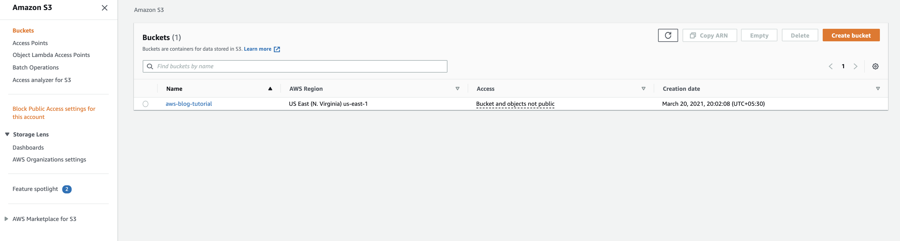
   
   3. Select Block all public access

      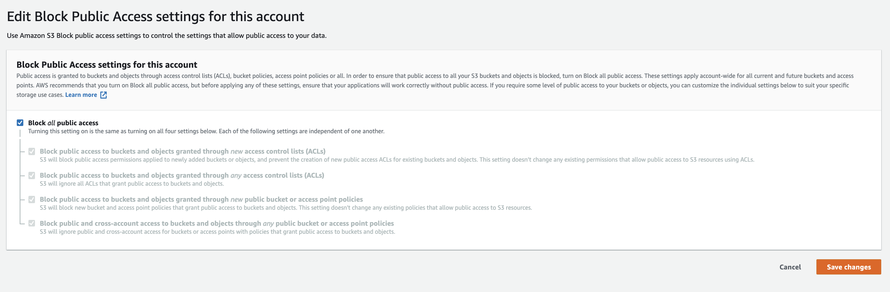

   4. Select Save changes and Type confirm to confirm the new settings then click Confirm

      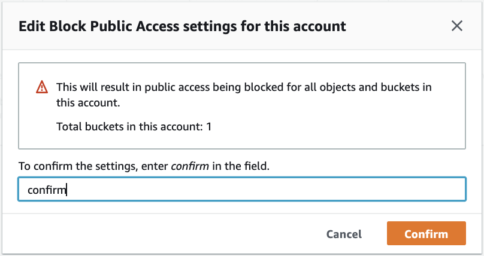
   
   5. Run the following command

       ```markdown 
        aws s3api put-object --key text01 --acl public-read --bucket ${bucket}  
       ```

        Request will fail, as we are trying to access object with acl as public.

        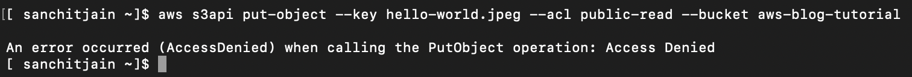

    6. Now run the following command using SSE-S3 encryption

       ```markdown 
        aws s3api put-object --key text01 --bucket ${bucket} 
       ```

        Command succeeded as the deafult for an object ACL is private.

        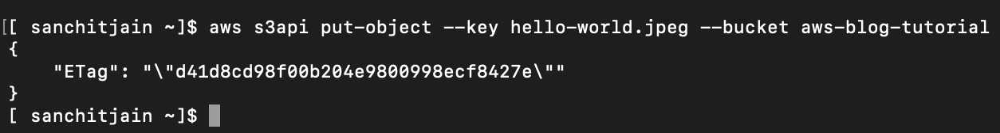

  iv. Restrict Access To A S3 Vpc Endpoint

  v. Use AWS Config Rules To Detect A Public Bucket

  vi. Use Amazon Access Analyzer For S3 


