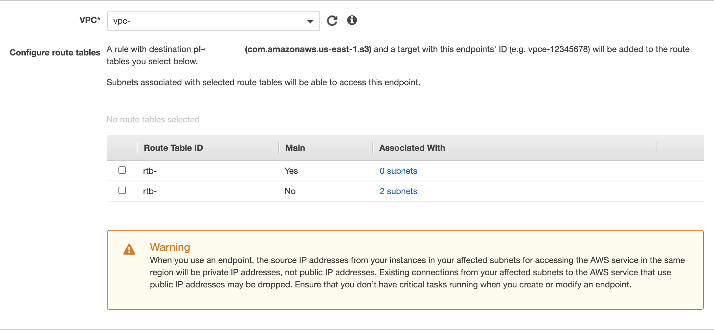

## AWS S3 Security

**Introduction**

- Amazon S3 provides an optimal foundation because of its virtually unlimited scalability. You can seamlessly and non-disruptively increase storage from gigabytes to petabytes of content, paying only for what you use. Amazon S3 is designed to provide 99.999999999% durability. 
- It has scalable performance, ease-of-use features, and native encryption and access control capabilities. Amazon S3 integrates with a broad portfolio of AWS and third-party ISV data processing tools. 
- With the wide usage of Amazon S3 it is important to configure the right security posture to it and below are a couple of security configuration we should enable
  - Enable Https
  - Enable SSE-S3 Encryption
  - Configure S3 Block Public Access
  - Restrict Access To A S3 Vpc Endpoint
  - Use AWS Config Rules To Detect A Public Bucket

  **i. Enable Https**

  In this section, we will create an S3 Bucket Policy that requires connections to use HTTPS
  
   1. From the AWS console, click Services, and select S3

   2. Select the bucket name

   3. Select on the Permissions tab

   4. Under Bucket Policy click Edit

   5. Copy the bucket policy below and paste it into the Bucket Policy Editor and Select Save changes

           {
            "Statement": [
            {
               "Action": "s3:*",
               "Effect": "Deny",
               "Principal": "*",
               "Resource": "arn:aws:s3:::BUCKET_NAME/*",
               "Condition": {
                   "Bool": {
                    "aws:SecureTransport": false
                    }
                }
                }
              ]
            }
      
        Replace BUCKET_NAME with the bucket name you copied to your text editor
        
        

    6. Run the following command

       ```markdown 
        aws s3api head-object --key app1/file1 --endpoint-url http://s3.amazonaws.com --bucket ${bucket}
       ```

        The output  will return a 403 error as the endpoint-url is HTTP

        

    7. Now run the following command

       ```markdown 
        aws s3api --endpoint-url https://s3.amazonaws.com head-object --key app1/file1 --bucket ${bucket}
       ```

        As we are leveraging s3api which uses HTTPS output will be successful 

        


  **ii. Enable SSE-S3 Encryption**
  
  In this section, we will create an S3 Bucket Policy that requires data at rest encryption
  
   1. From the AWS console, click Services and select S3

   2. Select the bucket name

   3. Select on the Permissions tab

   4. Under Bucket Policy click Edit

   5. Copy the bucket policy below and paste it into the Bucket Policy Editor and Select Save changes

           {
            "Statement": [
                {
                    "Effect": "Deny",
                    "Principal": "*",
                    "Action": "s3:PutObject",
                    "Resource": "arn:aws:s3:::BUCKET_NAME/*",
                    "Condition": {
                        "StringNotEquals": {
                            "s3:x-amz-server-side-encryption": "AES256"
                        }
                    }
                }
            ]
           }

        Replace BUCKET_NAME with the bucket name you copied to your text editor
        
        

    6. Run the following command

       ```markdown 
        aws s3api put-object --key text01 --bucket ${bucket}  
       ```

        The request will fail, as the object is not encrypted.

        

    7. Now run the following command using SSE-S3 encryption

       ```markdown 
        aws s3api put-object --key text01 --server-side-encryption AES256 --bucket ${bucket} 
       ```

        Command succeeded as SSE-S3 is enabled

        


  **iii. Configure S3 Block Public Access**
  
  In this section, we will enable S3 Block Public Access, a simpler method to block public access for S3 bucket
  
   1. From the AWS console, click Services and select S3

   2. Select Block public access from left panel and click Edit.
  
      
   
   3. Select Block all public access

      

   4. Select Save changes and Type confirm to confirm the new settings then click Confirm

      
   
   5. Run the following command

       ```markdown 
        aws s3api put-object --key text01 --acl public-read --bucket ${bucket}  
       ```

        The request will fail, as we are trying to access the object with acl as public.

        

    6. Now run the following command using SSE-S3 encryption

       ```markdown 
        aws s3api put-object --key text01 --bucket ${bucket} 
       ```

        Command succeeded as the default for an object ACL is private.

        

  **iv. Restrict Access To A S3 Vpc Endpoint**
  
   In this section, we will create an S3 Bucket which will be accessible only within a VPC by the AWS services deployed within that VPC by using a VPC Endpoint
   
   1. From the AWS console, click Services and select VPC

   2. Select Endpoints on the column to the left.

   3. Select S3 from the search option. This should filter to the S3 Endpoint. Select the Gateway endpoint.
   
        

   4. Under VPC, select the VPC you want and from the drop-down select Route Table ID you want to associate
   
        
  
   5. Select Create endpoint, copy the VPC Endpoint ID to your text editor, and Select Close
   
   6. From the AWS console, click Services and select S3

   7. Select the bucket name

   8. Select on the Permissions tab

   9. Under Bucket Policy click Edit

   10. Copy the bucket policy below and paste it into the Bucket Policy Editor and Select Save changes

              {
              "Statement": [
                  {
                      "Action": "s3:*",
                      "Effect": "Deny",
                      "Resource": "arn:aws:s3:::BUCKET_NAME/*",
                      "Condition": {
                          "StringNotEquals": {
                              "aws:sourceVpce": "VPC_ENDPOINT_ID"
                          }
                      },
                      "Principal": "*"
                      }
                  ]
              }

      
          Replace BUCKET_NAME with the bucket name and VPC_ENDPOINT_ID with the Endpoint ID
        
   11. Run the following command from a machine outside the VPC

       ```markdown 
        aws s3api head-object --key text01 --bucket ${bucket}   
       ```

        The request will fail, as we are trying to access the object from an external machine


   12. Run the following command from a machine inside the VPC

       ```markdown 
        aws s3api head-object --key text01 --bucket ${bucket} 
       ```

        Command succeeded as the host is part of VPC which is allowed to access the S3 object
     

  **v. Use AWS Config Rules To Detect A Public Bucket**
  
  In this section, we will focus on enabling AWS Config which acts as a detective measure to ensure the right sets of permission are configured for the AWS S3 bucket
     
   1. From the AWS console, click Services, and select Config
   
   2. Under Settings, leave the default selections and select Next
   
   3. Under Rules, select S3 service from the search bar. Look for s3-bucket-public-read-prohibited and select the rule and click Next.

   4. Next Review, verify the settings and select Confirm

      
      
